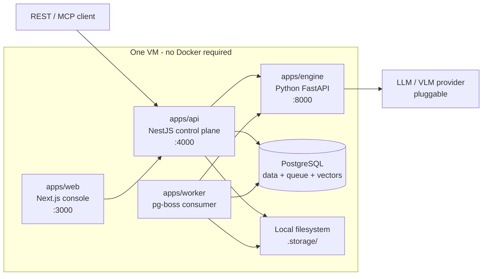

# BrandLens

**The verification layer for brand compliance.** API-first,
generator-agnostic, model-agnostic, with an auditable decision trace behind
every verdict.

An asset and a brand go in. Structured findings come out — each one carrying
the rule it violated, the measured value, the threshold, a bounding box, and a
citation back to the page of the brand book it came from.

BrandLens does not generate anything. That is the point: it is the thing you
put *after* any generator, including the ones that check their own output.

---

## Why it exists

Generative tools made creative production roughly ten times cheaper. Nothing
made brand governance cheaper. A brand that produced 200 assets a quarter now
produces 2 000, reviewed by the same two people, against a 68-page PDF.

The tempting answer — hand the asset to a vision model and ask "does this
comply" — fails in production. A model cannot count pixels. Forty
probabilistic checks compound to near-certain false positives. It costs an
order of magnitude too much. And "the model said the clear space looked tight"
is not a finding anyone can act on.

BrandLens runs checks in **three tiers**: deterministic parsing and arithmetic
first, classical computer vision second, and a vision judge last and least.
About 85% of a typical ruleset is arithmetic — which is both free and correct.

---

## Architecture



Four processes, one VM. No Redis, no MinIO, no Docker in the supported
production path. The queue is pg-boss inside the database that already exists,
which also means a job can be enqueued in the same transaction as the state
change that justifies it.

Full detail: **[docs/architecture.md](docs/architecture.md)**.

---

## Quickstart — Windows (the supported production path)

```powershell
# Elevated PowerShell
Set-ExecutionPolicy -Scope Process -ExecutionPolicy Bypass -Force

git clone <repo> C:\brandlens
Set-Location C:\brandlens

.\infra\windows\bootstrap.ps1 -IncludeCaddy -InstallDependencies
notepad .env                              # set DATABASE_URL and the five secrets

.\infra\windows\setup-database.ps1        # role, database, migrate, seed
.\infra\windows\setup-python.ps1          # engine virtualenv
pnpm build
.\infra\windows\install-services.ps1      # PM2 as a Windows service
.\infra\windows\healthcheck.ps1           # probe all four services + the database
```

Thereafter, shipping a change is one command on the VM:

```powershell
cd C:\brandlens
.\infra\windows\deploy.ps1      # pull, build, back up, migrate, reload, verify
```

It rolls the code back automatically if the health check fails. Add `-WhatIf`
to see the plan without touching anything. The full Mac → GitHub → VM loop,
including what CI is and why it matters when you build on macOS and run on
Windows, is in **[docs/github-workflow.md](docs/github-workflow.md)**.

`bootstrap.ps1` installs Node 20+, pnpm, Python 3.11+, PostgreSQL 16/17, PM2
and optionally Caddy through `winget`, with clear manual instructions when
`winget` is unavailable. Every script is idempotent, supports `-WhatIf` where
it is destructive, and prints an OK/FAIL line per step.

pgvector is **optional** — the schema falls back to `real[]` plus an in-SQL
cosine function, and the setup script says in plain language which path is
active.

Full runbook, including TLS, backups, upgrades and a troubleshooting table:
**[docs/deployment-windows.md](docs/deployment-windows.md)**.

## Quickstart — Linux / macOS (development)

```bash
git clone <repo> brandlens && cd brandlens
cp .env.example .env                      # edit DATABASE_URL and the secrets

# Optional: PostgreSQL with pgvector already compiled in.
# Developer convenience only — see the header of the file.
docker compose -f infra/docker/docker-compose.yml up -d

pnpm install
pnpm db:migrate && pnpm db:seed          # migrations are committed; just apply them

cd apps/engine && python -m venv .venv && ./.venv/bin/pip install -r requirements.txt && cd ../..

pnpm dev:api      # terminal 1  :4000
pnpm dev:worker   # terminal 2
pnpm dev:web      # terminal 3  :3000
cd apps/engine && ./.venv/bin/python -m uvicorn brandlens_engine.main:app --reload   # terminal 4  :8000
```

Sign in at `http://localhost:3000` with `owner@northwind.test` /
`BrandLens!2026`.

The seed creates **Northwind Coffee Co.** — a full brand ontology, generated
logo and creative PNGs, 57 rules (42 active, 15 awaiting review), 10 registered
assets including five with deliberately planted defects, and one completed
check run with decision traces, findings, a human override and a precedent. It
is idempotent and safe to re-run.

---

## An API taste

```bash
curl -s -X POST http://localhost:4000/v1/checks \
  -H "Authorization: Bearer $BRANDLENS_API_KEY" \
  -H 'Content-Type: application/json' \
  -d '{"assetId":"0c1e...","async":false}' | jq '.findings[0]'
```

```json
{
  "ruleKey": "color.forbidden-competitor",
  "dimension": "color",
  "severity": "blocker",
  "title": "Competitor equity colour covers 48% of the canvas",
  "detail": "#00704A is registered as a forbidden colour on this brand...",
  "bbox": [0, 0, 1, 0.3519],
  "displayConfidence": 0.99,
  "isHighConfidence": true
}
```

`async: false` blocks and returns the completed run, because an agent in a
generate → verify → fix loop has nothing to poll with.
`deterministicOnly: true` makes it free and instant, which is what you want on
every iteration of that loop.

The same three tools are exposed over MCP at `POST /v1/mcp`.

Full reference: **[docs/api.md](docs/api.md)**. Interactive OpenAPI at
`/docs`.

---

## Features

**Verification**
- Nine dimensions: logo, colour, typography, layout, imagery, copy,
  accessibility, channel spec, legal
- 38 analyzers across three tiers; ~85% of a typical ruleset costs nothing
- Graceful degradation: a budget-exhausted run ships its deterministic findings
  and marks the rest `insufficient_evidence`, rather than failing

**The brand ontology**
- Design tokens in W3C DTCG shape, with CIELAB precomputed
- Logo variants with real geometry and constraints
- Type styles with alias resolution; forbidden fonts as a broken-pipeline signal
- Voice attributes as `we are` / `we are not` with exemplars
- Lexicon, claims register with jurisdictions and expiry, disclaimers with
  size / contrast / proximity requirements
- A five-axis scope lattice resolved most-specific-wins with CSS-like
  specificity

**The decision trace**
- Immutable, content-addressed, append-only at the grant level
- Measured value, threshold, bounding box, evidence crop, citation, precedents
- `GET /v1/findings/:id/explain` answers "why did this fail?" in one call

**Learning without training**
- Per-rule threshold calibration from human overrides
- Precedent retrieval, balanced pass/fail so the label prior does not leak
- GEPA-style prompt optimisation from reviewer rationales
- Selective abstention below a confidence threshold
- A kill switch: `beta < 0.3` routes a rule 100% to humans

**Platform**
- Multi-tenancy via PostgreSQL RLS, with `FORCE ROW LEVEL SECURITY`
- Transactional outbox; webhooks with HMAC-SHA256 over `timestamp.body`
- MCP surface for agent loops
- Content-addressed job keys buying idempotency, caching, invalidation and
  reproducibility from one design
- Prometheus metrics, structured logs, correlation ids across all four
  processes

---

## Repository map

```
apps/
  api/          NestJS control plane — tenancy, orchestration, audit trail, scoring
  worker/       pg-boss consumer — ingestion, analysis, learning, outbox relay
  web/          Next.js console
  engine/       Python FastAPI — measurement and judgment. Stateless.

packages/
  contracts/    zod schemas: the single source of truth for API, engine and client
  db/           Drizzle schema, migrations, RLS policies, and the demo seed

infra/
  windows/      The supported production path: 9 PowerShell scripts + PM2 config
  caddy/        Reverse proxy with automatic HTTPS
  docker/       Optional, developer machines only

docs/
  architecture.md          How it works and why
  api.md                   REST, webhooks, MCP
  data-model.md            Table-by-table reference + ER diagram
  deployment-windows.md    The Windows runbook
  operations.md            Day-2: metrics, alerts, scaling, incidents
  product.md               What it is for and who buys it
  adr/                     Ten architecture decision records

seed/
  assets/       Generated logo and creative PNGs, checked in and reviewable
```

---

## Tech stack

| Layer | Choice | Why |
|---|---|---|
| Control plane | NestJS 10, TypeScript 5.6 | Modules, DI, guards, interceptors — the tenancy story fits it |
| Validation | zod, end to end | One schema for the API, the engine protocol and the client |
| ORM | Drizzle | Schema as TypeScript, which is what makes the RLS helper type-safe |
| Database | PostgreSQL 16/17 | Data, job queue and vectors in one durable thing |
| Queue | pg-boss | No Redis. Transactional enqueue. [ADR-0002](docs/adr/0002-pg-boss-not-redis.md) |
| Vectors | pgvector, optional | `real[]` + in-SQL cosine fallback. [ADR-0003](docs/adr/0003-pgvector-optional.md) |
| Analysis | Python 3.11, FastAPI, numpy, scikit-image, opencv, pymupdf | Where the algorithms are |
| Console | Next.js 15, React 19 | |
| Auth | JWT + peppered API keys, bcryptjs cost 12 | Pure JS: no compiler on the Windows target |
| Storage | Local filesystem, S3 or Azure | Content-addressed. [ADR-0009](docs/adr/0009-local-storage-default.md) |
| Models | Anthropic, OpenAI, Azure OpenAI, Google, OpenAI-compatible | Model-agnostic by design |
| Process manager | PM2 as a Windows service | No Docker. [ADR-0010](docs/adr/0010-pm2-on-windows.md) |
| Proxy | Caddy | One .exe, automatic HTTPS |

---

## Documentation

| Document | Read it when |
|---|---|
| [architecture.md](docs/architecture.md) | You want to understand the system |
| [api.md](docs/api.md) | You are integrating |
| [data-model.md](docs/data-model.md) | You are writing queries or a migration |
| [deployment-windows.md](docs/deployment-windows.md) | You are installing or operating it |
| [github-workflow.md](docs/github-workflow.md) | You develop on a Mac and deploy to the VM — CI, branches, `deploy.ps1` |
| [operations.md](docs/operations.md) | It is running and you want it to keep running |
| [product.md](docs/product.md) | You want the positioning and the roadmap |
| [adr/](docs/adr/) | You disagree with a decision and want the reasoning |

---

## Contributing

See [CONTRIBUTING.md](CONTRIBUTING.md).

```bash
pnpm typecheck        # every package
pnpm test             # vitest for TS
pnpm lint
cd apps/engine && ./.venv/bin/pytest && ./.venv/bin/ruff check .
```

---

## Licence

Proprietary. See [LICENSE](LICENSE).

