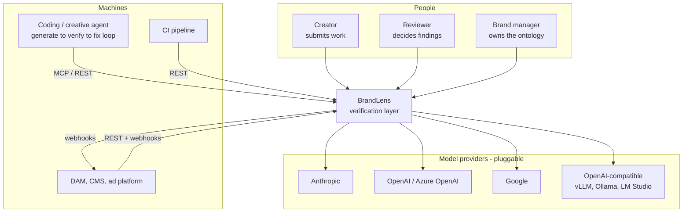
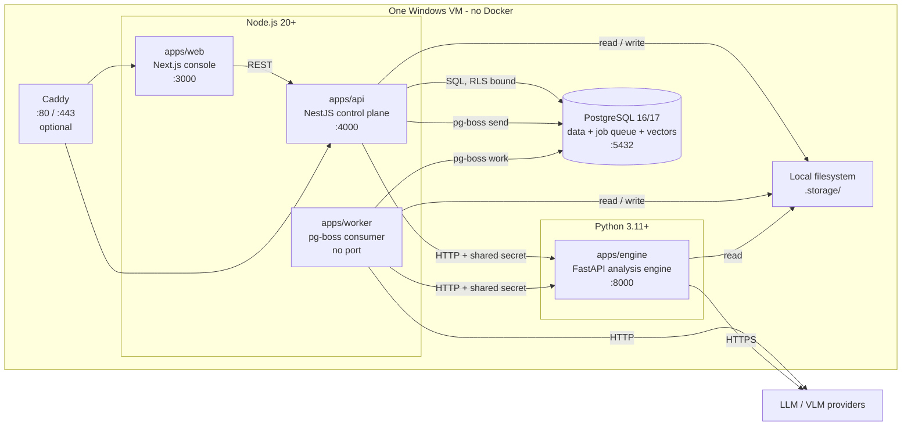
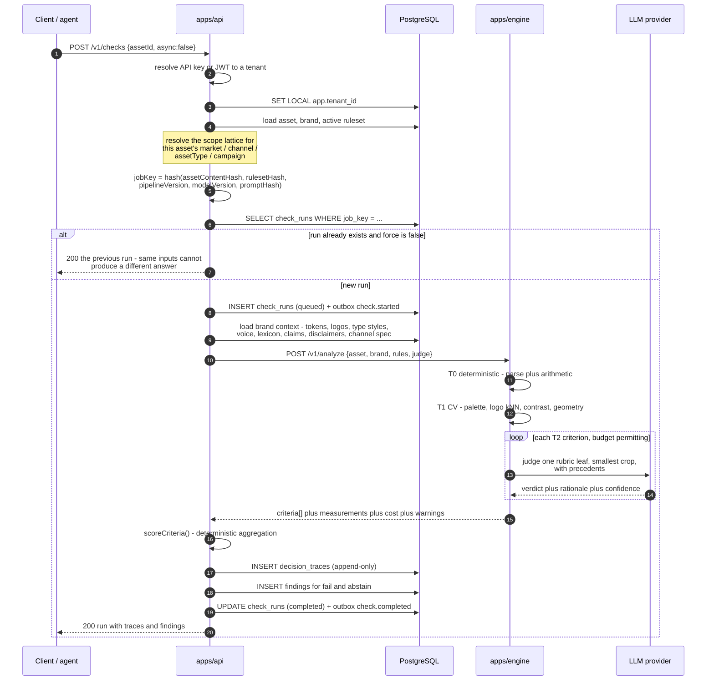
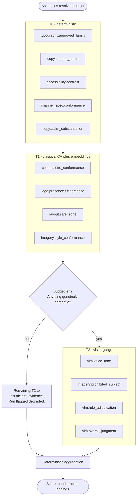
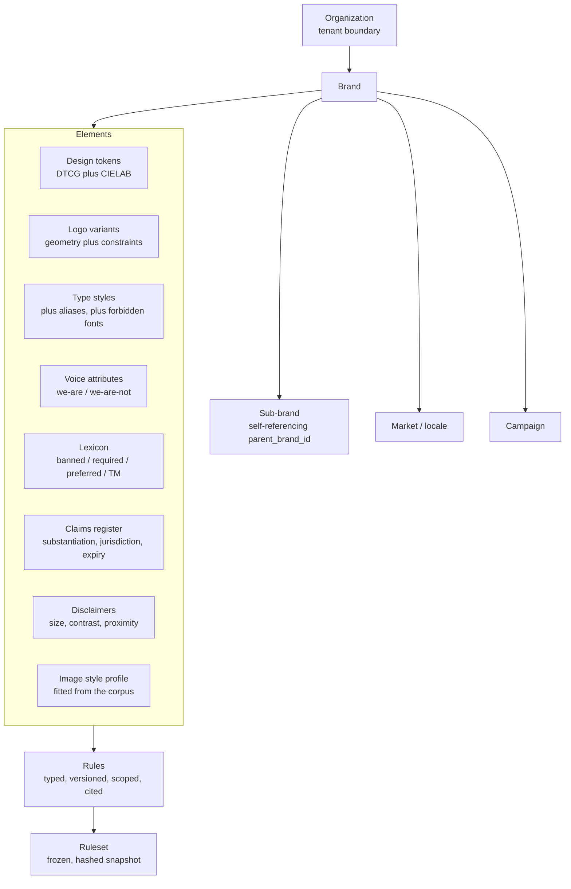
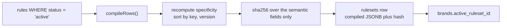
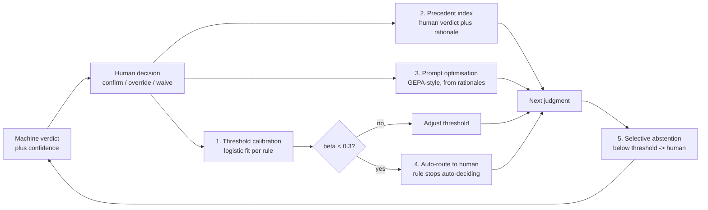
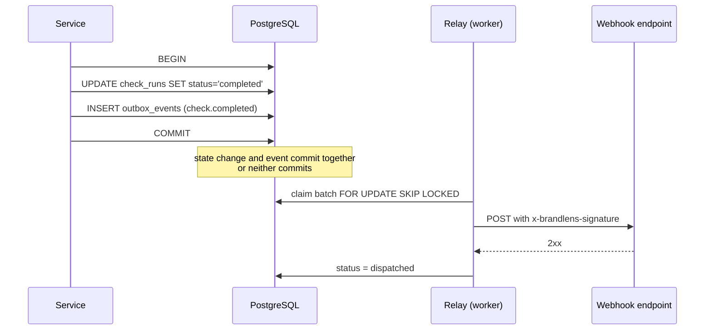

# BrandLens — Architecture

BrandLens is a brand-compliance **verification** layer. An asset and a brand go
in; structured findings come out, each one backed by a rule, a measured value,
a threshold, a bounding box and a citation.

It is deliberately not a generator. It is generator-agnostic and
model-agnostic, and it treats the decision trace — not the score — as the
product.

**Contents**

1. [System context](#1-system-context)
2. [Containers](#2-containers)
3. [The request lifecycle](#3-the-request-lifecycle)
4. [The three-tier check model](#4-the-three-tier-check-model)
5. [The brand ontology and the scope lattice](#5-the-brand-ontology-and-the-scope-lattice)
6. [Brand compile and `ruleset_hash`](#6-brand-compile-and-ruleset_hash)
7. [Content-addressed keys](#7-content-addressed-keys)
8. [The decision trace](#8-the-decision-trace)
9. [Scoring](#9-scoring)
10. [The learning loop](#10-the-learning-loop)
11. [Multi-tenancy](#11-multi-tenancy)
12. [Queue and pools](#12-queue-and-pools)
13. [Storage](#13-storage)
14. [Vector search](#14-vector-search)
15. [Observability](#15-observability)
16. [What is deliberately absent](#16-what-is-deliberately-absent)

---

## 1. System context



The wedge is `POST /v1/checks`. Everything else — the console, the review
queue, the analytics — exists because that endpoint produces something worth
looking at.

**Positioning.** Adobe's Brand Intelligence is a generator that also checks its
own output. That is a conflict of interest a regulated reviewer cannot accept,
and it only covers assets Adobe made. BrandLens verifies anything, from any
generator, using a judge model deliberately chosen from a *different* family
than the generator, because a model asked to grade its own output exhibits
measurable self-preference bias.

---

## 2. Containers



| Container | Language | Owns | Talks to |
|---|---|---|---|
| `apps/api` | TypeScript / NestJS | Tenancy, ontology CRUD, orchestration, the audit trail, scoring | Postgres, engine, storage |
| `apps/worker` | TypeScript | Every queue in `contracts/events.ts`, the outbox relay, reconciliation | Postgres, engine, storage |
| `apps/web` | TypeScript / Next.js | The console | api |
| `apps/engine` | Python / FastAPI | Measurement and judgment. **Stateless.** | Storage (read), LLM providers |
| `packages/contracts` | TypeScript / zod | The single source of truth for the API surface, the engine protocol and the web client | — |
| `packages/db` | TypeScript / Drizzle | Schema, migrations, RLS policies, the seed | Postgres |

Four processes, one VM, no Docker, no Redis, no MinIO. The rationale is in
[ADR-0010](adr/0010-pm2-on-windows.md).

### Why the split is TypeScript plus Python

The control plane is I/O, transactions, tenancy and an audit trail. NestJS plus
Drizzle plus zod is a good fit and gives one type system shared with the web
client.

The analysis engine is `numpy`, `scikit-image`, `opencv`, `pymupdf` and
`rapidfuzz`. Reimplementing CIELAB clustering and PDF span extraction in
TypeScript would be worse code that produces worse answers.

They are separate *processes* rather than separate *services* in the
distributed-systems sense: the engine holds no state, has no database, and
authenticates one caller over a loopback hop. See
[ADR-0001](adr/0001-hybrid-ts-python-split.md).

---

## 3. The request lifecycle

`POST /v1/checks` with `async: false` — the path an agent uses, because an
agent in a generate → verify → fix loop has nothing to poll with.



With the default `async: true` the API returns `202` after step 8 and the
worker performs steps 9-19 by consuming `analyze.asset`. `ChecksService.execute`
is the *same method* in both paths — the synchronous path calls it inline. Two
implementations would drift, and the score for an asset would then depend on
which process happened to run it.

### The engine's URL contract

Analysis routes are versioned under `/v1` (`/v1/analyze`, `/v1/extract-rules`,
`/v1/induce-rules`, `/v1/assemble`, `/v1/predict`, `/v1/embed`) and require the
`X-Engine-Secret` header. Three routes deliberately sit at the root and need no
auth, so a load balancer or an operator can probe the process without knowing
which API version is deployed:

| Route | Purpose |
|---|---|
| `GET /health` | Liveness. Is the process up? Returns `{status, engineVersion}` and nothing else. |
| `GET /health/deep` | Capability. Which analyzers are registered, which LLM roles hold credentials, which OCR driver resolved. |
| `GET /version` | Build info. |

Do not validate `/health` against the `EngineHealth` contract — that schema
describes `/health/deep`, and the liveness probe will never satisfy it.

`degraded` from `/health/deep` is a **normal operating state**, not an outage.
An engine with no LLM credentials still runs every T0 and T1 check and produces
real, auditable findings; it abstains on T2 rather than inventing verdicts.
Alert on `error`, not on `degraded`.

There are two HTTP clients for the engine — the API's injectable one and the
worker's standalone one, because the worker has no Nest container — so the path
rule lives in exactly one place, `apps/api/src/engine/engine-path.ts`, which
both import. When the two clients disagreed about the `/v1` prefix during
integration, queued checks 404'd while synchronous checks succeeded: the same
asset returned a result or an error depending on whether the caller passed
`async: true`. A verification product cannot afford to look non-deterministic,
so anything both paths depend on is shared code, never a copy. The same rule
applies to `scoring/scoring.ts`, `rulesets/compile.ts` and
`checks/finding-detail.ts`.

See also [ADR 0011](adr/0011-cross-language-null-boundary.md) for how optional
fields are typed across this boundary — Pydantic emits `null` where zod's
`.optional()` expects an absent key, and getting that wrong reports a healthy
engine as unreachable.

**Idempotency at every layer.** The `job_key` unique index collapses duplicate
POSTs. `execute()` returns early on an already-completed run, because pg-boss
guarantees at-least-once delivery and *will* invoke the handler twice. Trace
inserts are keyed on `trace_key`.

---

## 4. The three-tier check model

Never VLM-first. This is the single most consequential design decision in the
product ([ADR-0005](adr/0005-tiered-checks.md)).



| Tier | Implementation | Cost per criterion | Precision | Share of a typical ruleset |
|---|---|---|---|---|
| **T0** deterministic | Parse + arithmetic. Font names, term matching, contrast ratios, claim dates, channel specs. | ~$0 | ~100% given correct extraction | ~45% |
| **T1** CV | ΔE clustering, logo kNN over an embedding gallery, safe-zone geometry, style-manifold distance. | ~$0.001 | 90-97% | ~40% |
| **T2** VLM | One rubric leaf, smallest crop, precedent-conditioned. | $0.005-0.05 | 70-90% | ~15% |
| **hybrid** | T1 measures, T2 adjudicates the measurement. | T2 cost | Between the two | small |

`registry.py` records the tier an analyzer *actually* runs at, independent of
what a rule claims, and `effective_tier()` takes the stricter of the two. A
rule mislabelled `cv` cannot smuggle a paid VLM call past the budget guard.

Execution order is `deterministic → cv → hybrid → vlm`, with
`vlm.overall_judgment` last so it can see everything already decided.

**The economics.** A forty-criterion ruleset run VLM-first is forty vision
calls, roughly \$0.60–\$2.00 per asset, at 70-90% precision. Tiered, it is
about six vision calls: roughly \$0.03–\$0.10 per asset, and the 85% of
criteria that were arithmetic are now *right* rather than probably right.

**Degradation, not failure.** When `budget_allows_t2()` forecasts that the next
criterion would overshoot the ceiling, the remaining T2 criteria return
`insufficient_evidence` with an explanation and the run is marked `degraded`.
A partial answer with an honest gap beats an error, and beats a fabricated
pass by a much wider margin.

---

## 5. The brand ontology and the scope lattice



A rule is the core primitive: a statement, a dimension, a tier, a severity, a
weight, a scope selector, a `check` naming an analyzer plus parameters, an
optional rubric, a provenance, and — for machine-derived rules — either a
citation or a support object.

### Scope resolution is most-specific-wins with CSS-like specificity

Five axes, weighted by **powers of ten** (`apps/api/src/rulesets/specificity.ts`):

| Axis | Weight |
|---|---|
| `subBrands` | 1 |
| `markets` | 10 |
| `channels` | 100 |
| `assetTypes` | 1 000 |
| `campaigns` | 10 000 |

Powers of ten, not 1-2-3-4-5, so a constraint on a more specific axis outranks
*any* combination of constraints on less specific ones — one id beats a hundred
classes. Summing equal weights produces genuinely wrong answers: a
campaign-specific co-branding exemption would lose to a rule that merely names
two markets and a channel, and that exemption is the entire reason the campaign
axis exists.

Specificity is **not** a function of how many values an axis lists.
`markets: ['de-DE']` and `markets: ['de-DE','fr-FR']` are equally specific
statements about the market axis; letting cardinality leak in would make a
broader rule beat a narrower one.

An axis is unconstrained when it is absent, empty, or `['*']`. A rule that
constrains an axis the asset does not populate **cannot apply** — treating
"unknown market" as "matches every market" would fire German legal rules on
assets whose market was never set.

### Worked example

Three rules share the key `logo.min-size`:

| # | Scope | Specificity |
|---|---|---|
| A | `{}` — global | 0 |
| B | `{ markets: ['de-DE'] }` | 10 |
| C | `{ markets: ['de-DE'], channels: ['meta-story'] }` | 110 |

Resolving for an asset with `market = de-DE`, `channel = meta-story`:

1. all three match `scopeMatches`;
2. ordering is specificity desc → **C** (110) wins;
3. A and B never execute for this asset.

Resolving for `market = de-DE`, `channel = meta-feed`: C's channel axis
excludes it, so **B** (10) wins. Resolving for `market = en-US`: **A** wins.

Ties are broken by version desc, then `createdAt` desc, then key. Every tier is
needed: `markets:['de-DE']` and `markets:['fr-FR']` both score 10, and without
a **total** order the compiled snapshot would depend on whatever row order
Postgres happened to return — which would change the ruleset hash and silently
invalidate the entire result cache.

**One caveat, stated plainly.** `ChecksService` builds the resolution context
from the asset row: `market`, `channel`, `assetType`, `campaignId`. There is no
sub-brand column on `assets`, so a `scope.subBrands` constraint never matches
anything. Sub-brand differences are expressed by **owning** the rule on the
sub-brand's own `brands` row, which compiles into that brand's own ruleset.
The seed does exactly this for the Northwind Reserve colour rules.

---

## 6. Brand compile and `ruleset_hash`

Resolving the lattice is expensive and must be reproducible, so it is
precomputed and frozen.



`compile()` selects only `status = 'active'`. A `proposed` rule can never
influence a verdict — that separation is what makes the audit trail defensible
when the rules were machine-extracted ([ADR-0008](adr/0008-rules-land-as-proposed.md)).

The hash covers **only semantically meaningful fields**: key, version,
statement, dimension, tier, severity, weight, scope, specificity, check,
rubric, plus the scoring config. Labels, publish timestamps and row ids are
excluded, because a cosmetic edit must not invalidate every cached verdict in
the tenant.

Publishing is one transaction: insert the snapshot, move
`brands.active_ruleset_id`, emit `ruleset.published`. The moment the pointer
moves, every new check is priced against the new hash — and a webhook consumer
must not be told about a ruleset a rollback removed.

Republishing an identical snapshot is a no-op: the same rules produce the same
hash and the unique index on `(brand_id, hash)` catches it. That matters,
because "publish" is a button a nervous brand manager clicks repeatedly.

---

## 7. Content-addressed keys

One design choice buys four properties at once.

```
job_key   = sha256(assetContentHash, rulesetHash, pipelineVersion,
                   modelVersion, promptHash, variant)

trace_key = sha256(assetContentHash, rulesetHash, ruleKey, ruleVersion,
                   modelVersion, promptHash)
```

Those inputs are **exactly** the set of things that can change the answer.

| Property | Mechanism |
|---|---|
| **Idempotency** | `check_runs_job_key_uq` on `(org_id, job_key)`. Retries and duplicate POSTs collapse onto one run. |
| **Caching** | An unchanged asset under an unchanged ruleset is free. Target hit ratio > 60%. |
| **Invalidation** | Publishing a ruleset changes `rulesetHash`, so every affected run re-executes — and only those. |
| **Reproducibility** | A regulator can be told precisely which bytes, which rules, which code and which model produced a verdict. |

`trace_key` is finer-grained on purpose. Editing one rule changes the ruleset
hash and therefore the job key, but every *other* rule's trace key is
unchanged — so the expensive VLM verdicts for untouched rules are replayed
from cache rather than re-purchased. Editing one rule in a forty-rule ruleset
costs one rule's worth of judgment, not forty.

Hashing is over **canonical JSON**: keys sorted recursively, `undefined`
dropped, arrays left in order. `JSON.stringify` preserves insertion order, so
two structurally identical objects built by different code paths would
stringify differently, hash differently, and miss the cache forever.

`variant` partitions the key space for a deliberate re-run: a dimension filter,
a `deterministicOnly` pass, or a caller-supplied `Idempotency-Key`. A partial
re-check never collides with the full run it is a subset of.

---

## 8. The decision trace

**This table is the product.**

`decision_traces` is immutable and content-addressed. Every row carries:

- the rule, its version and its dimension;
- the tier that produced the verdict;
- the verdict, from a five-member enum: `pass`, `fail`, `not_applicable`,
  `insufficient_evidence`, `abstained`;
- `confidence` — null for deterministic tiers, because arithmetic does not
  hedge;
- `model` — provider, model id, prompt hash, temperature, self-consistency `k`,
  vote entropy. Null for deterministic tiers;
- `evidence` — `{ measured, threshold, bbox, cropKey, quotedText, observation }`;
- `precedent_asset_ids` — the past decisions used as few-shot context;
- `citation` — the brand-book page and normalised bbox;
- `suggested_fix`.

"Why did this fail?" renders the rule text, the citation to page 14 of the
brand book, the measured value against its threshold, the cropped evidence, and
precedent assets decided the same way. That artifact is what makes the tool
usable in regulated review, and it is why `GET /v1/findings/:id/explain` is a
first-class endpoint rather than a debug view.

`not_applicable` and `insufficient_evidence` are **mandatory** enum members.
Without them, a judge is forced to invent a verdict — the largest single source
of the false positives that destroy reviewer trust.

Immutability is enforced at the grant level:

```sql
REVOKE UPDATE, DELETE ON public.decision_traces FROM PUBLIC;
REVOKE UPDATE, DELETE ON public.audit_log      FROM PUBLIC;
```

That makes "immutable trail" a claim defensible in a compliance review rather
than a promise in the UI.

---

## 9. Scoring

The headline number is **deterministic aggregation over atomic criteria**. It
is never a number a model produced ([ADR-0006](adr/0006-deterministic-scoring.md)).

```
severity weight   blocker 4 · major 3 · minor 1 · advisory 0

per criterion     contribution = max(0, rule.weight) × severityWeight[severity]
                  only pass and fail participate

per dimension     score = 100 × earned / possible

headline          weighted mean of the DIMENSION scores,
                  using ruleset.scoringConfig.dimensionWeights

band              hasBlocker            -> fail
                  score >= 85           -> pass
                  score >= 70           -> conditional
                  otherwise             -> fail
```

Four consequences worth stating:

- **`advisory` weighs 0.** An advisory must never move the number. The moment a
  false-positive advisory costs a customer a point, they stop trusting the score
  and start arguing with it. Advisories still raise findings — they just do not
  price.
- **`not_applicable` and abstentions are excluded from the denominator.**
  Scoring them as passes would inflate the number; as failures it would punish
  the customer for our uncertainty.
- **Aggregation is per dimension first.** Otherwise a dimension with fifty
  typographic leaves drowns out one with three legal ones.
- **A failed blocker is `fail` at score 99.** "Everything is perfect except the
  mandatory legal disclaimer is missing" is not a conditional pass in any
  jurisdiction that matters.

`coverage_rate` — the share of criteria the machine settled without a human — is
the headline customer-facing metric. Abstentions are the entire point of its
denominator.

`apps/api/src/scoring/scoring.ts` has no framework imports precisely so the
worker can share it with the API.

---

## 10. The learning loop

No fine-tuning, no training runs, no GPU. Five stages, each of which either
improves precision or reduces cost.



**1 — Threshold calibration.** After every review decision,
`CalibrationService.calibrateRule` refits `P(human rejects | machine signal)`
with a logistic model over the traces the decisions overruled. It needs the
trace to have kept the confidence the machine reported at the time, which is
why that column exists. Minimum 8 samples.

**2 — Precedent retrieval.** At judge time, k nearest decided precedents for
*that specific rule* are injected as in-context examples with their verdicts and
reviewer rationales. Retrieval is **balanced pass/fail** so the label prior does
not leak and turn the judge into a yes-machine. This is what produces "it
learned our brand" behaviour with zero training.

**3 — Prompt optimisation.** Reviewer rationales are natural language, which is
exactly what GEPA-style optimisation consumes. The optimised prompt is stored
per tenant per rule (`rules.optimized_prompt`, `optimized_prompt_hash`) — and
because the prompt hash is an input to `trace_key`, optimising a prompt
correctly invalidates that rule's cached verdicts and nothing else.

**4 — The kill switch.** `beta` is the slope of the calibration fit.
`|beta| < 0.3` means the machine's confidence carries essentially no
information about whether these reviewers will accept the verdict — the model
is not measuring what these humans mean by this rule. The rule is then routed
**100% to human review** (`auto_route_to_human`), surfaced on the rule-health
page, and stays there until the fit improves. A rule that quietly disagrees
with a customer is worse than a rule that admits it cannot help.

**5 — Selective abstention.** Below `JUDGE_ABSTAIN_CONFIDENCE` (default 0.55)
the verdict is `abstained` and the criterion goes to a human. On genuinely
ambiguous items, self-consistency escalation samples `k = 3` and uses the vote
entropy as the confidence signal.

**Why multi-annotator labels matter.** `review_decisions.is_calibration_label`
marks double- and triple-annotated items. Clean multi-annotator data produces
far narrower judge intervals than single-annotator data at the same sample
size, which makes it the highest-ROI labelling spend available.

---

## 11. Multi-tenancy

Shared schema, `org_id` on every tenant table, enforced by PostgreSQL row-level
security rather than by trusting application code
([ADR-0004](adr/0004-shared-schema-rls.md)).

```sql
CREATE POLICY brands_tenant_isolation ON public.brands
  USING       (brandlens_rls_bypassed() OR org_id = brandlens_current_tenant())
  WITH CHECK  (brandlens_rls_bypassed() OR org_id = brandlens_current_tenant());
```

### Why `SET LOCAL` and not `SET`

`withTenant()` in `packages/db/src/client.ts` is the **only** sanctioned way to
run a tenant query:

```ts
return database.transaction(async (tx) => {
  await tx.execute(sql`SELECT set_config('app.tenant_id', ${ctx.orgId}, true)`);
  //                                                                   ^^^^
  //                                            true = local to this transaction
  ...
});
```

A plain `SET` is **session**-scoped. With any transaction-pooling proxy —
PgBouncer, RDS Proxy, or simply a connection returned to the pool mid-request —
the setting outlives the request and the next tenant to borrow that connection
inherits it. That is a cross-tenant data breach waiting to happen, and it is
invisible in testing because a single-tenant test never notices.

`SET LOCAL` (`set_config(..., true)`) is scoped to the transaction and is
discarded on commit or rollback, which is why the helper opens an explicit
transaction even for a single read.

### Why `FORCE ROW LEVEL SECURITY`

`ENABLE ROW LEVEL SECURITY` alone does not apply policies to the table's
**owner**. Migrations run as the owner, and so does the application role on a
typical single-role install, so `ENABLE` on its own is a silent hole: every
policy is present, correct, and bypassed. `FORCE` closes it. Both are applied
to all 38 tenant tables in `10_rls.sql`.

### The escape hatch

`app.bypass_rls = 'on'` is explicit, auditable and used in exactly four places:

1. migrations;
2. registration (creating an org necessarily precedes the org existing);
3. API-key resolution (runs before any tenant context exists);
4. the outbox relay (dispatches across tenants).

`channel_specs` has a bespoke policy: rows with `org_id IS NULL` are the
shipped global registry, readable by every tenant; a tenant may only write rows
carrying its own `org_id`. So a tenant override shadows a shipped spec without
being able to corrupt it for anyone else.

---

## 12. Queue and pools

pg-boss, in the database that already exists. No Redis
([ADR-0002](adr/0002-pg-boss-not-redis.md)).

The constraint was a Windows VM with no Docker, but the property that matters
is better than the constraint: **because jobs are rows, a job can be enqueued
in the same transaction as the state change that justifies it**. That removes
an entire class of "committed but never queued" and "queued but rolled back"
bugs, and it is what makes the transactional outbox trivial.

Three pools, because the workloads have incompatible shapes:

| Pool | Queues | Bound by | Default concurrency |
|---|---|---|---|
| `cpu_media` | `ingest.asset`, `embed.asset`, `ontology.induce-rules` | CPU and disk | 4 |
| `llm_io` | `analyze.asset`, `ontology.extract-document`, `assemble.brief`, `predict.asset` | Remote latency | 12 |
| `default` | `ontology.compile-ruleset`, `learning.*`, `platform.*` | Nothing much | 8 |

Without the split, thirty concurrent ffmpeg-shaped jobs starve the LLM path and
a synchronous check waiting behind them times out. `llm_io` polls at 1s and the
others at 2s.

The API runs pg-boss with `supervise: false, schedule: false` — it only
publishes. The worker owns maintenance, archiving and the cron scheduler, so
running two API instances does not double the maintenance load.

### The transactional outbox



`FOR UPDATE SKIP LOCKED` is what lets two relays run without serialising on the
same rows. The relay also polls on a one-minute cron, so a lost nudge from the
API only delays delivery.

Nobody listening is a **successful** dispatch, not a failure: the outbox
guarantees delivery to subscribers, it does not require one to exist.

`platform.reconcile` runs every five minutes and is the only thing that notices
a `SIGKILL`ed handler — a run stuck in `running` with no live job.

---

## 13. Storage

Three drivers behind one interface: `local` (default), `s3`, `azure`.

Layout is content-addressed:

```
originals/<org_id>/<first 2 hex of sha256>/<sha256>.<ext>
derivatives/<org_id>/<ab>/<asset_hash>/<kind>-<transform_hash>.<ext>
```

Sharding on the first byte of the hash keeps directory sizes sane — on NTFS, a
single folder with 200 000 entries turns every `readdir` into a stall.
Addressing by hash rather than by asset id makes deduplication free: the same
file uploaded by five people occupies one blob.

The local driver signs URLs with HMAC-SHA256 over `key|expiry|disposition`, and
the API serves the bytes itself at `/v1/storage/object`. There is no static
file server to misconfigure and no directory left world-readable on the VM.
Every key is resolved and re-checked against the root, because a storage key is
partly caller-influenced and `../../` in one would otherwise be an
arbitrary-file-write primitive.

Derivatives are keyed by `(asset_id, kind, transform_hash)` so they dedupe and
can be lifecycle-expired aggressively — they are reproducible from the original.

See [ADR-0009](adr/0009-local-storage-default.md).

---

## 14. Vector search

Two drivers behind one interface, selected at boot and recorded in
`system_state` so the API and the worker agree — and so the choice appears on
`/health/deep` instead of being invisible.

| Driver | Requires | How |
|---|---|---|
| `pgvector` | the extension | shadow `vec_p vector(N)` column, HNSW index, kept in sync by trigger |
| `fallback` | nothing | `real[]` plus `brandlens_cosine_similarity()`, an `IMMUTABLE PARALLEL SAFE` plpgsql function |

`VECTOR_DRIVER=auto` detects; `pgvector` and `fallback` force.

The `real[]` column is **always** populated, on both paths. pgvector, when
present, is a pure speedup. Requiring it would make the product undeployable on
the exact machine most customers already have
([ADR-0003](adr/0003-pgvector-optional.md)).

Embeddings are pure functions of `(bytes, model_id, preprocessing_version)` and
are never recomputed. `preprocessing_version` matters: a change to the
resize/crop/normalise code silently invalidates every vector, and without the
field you would not know it had happened.

---

## 15. Observability

**Structured logs.** pino for Node, structlog for Python, JSON in production.
A correlation id is generated by `CorrelationIdMiddleware`, echoed as
`x-correlation-id`, propagated to the engine as `x-request-id`, and carried
through queue payloads. One id follows a request across all four processes.

**Metrics.** `GET /metrics` is Prometheus text exposition, `Public` so a scraper
needs no credentials — which is exactly why the Caddyfile restricts it by
source IP. It exposes per-tenant job counts and cost totals.

**Health.**

| Endpoint | Purpose | Dependencies |
|---|---|---|
| `GET /health` | Liveness | **None**, deliberately. A stuck database must not make the process look dead. |
| `GET /health/deep` | Readiness | Database, queue, storage, engine, vector driver, outbox depth, provider configuration. Each with the failure detail, not a bare `false`. |

**The audit log.** Append-only, per tenant, with actor (user or API key),
action, entity, and a redacted payload. Regulated buyers pay for the trail more
than for the AI, so it is a core table rather than an add-on. Raw creative
content never goes in it.

**Cost.** Every paid call writes a `cost_ledger` row with input tokens, cached
input tokens, output tokens, image count, cost and cache-hit flag. Budgets read
from it; so does `GET /v1/analytics/cost`.

The metrics that actually matter operationally are in
[operations.md](operations.md).

---

## 16. What is deliberately absent

| Not present | Why |
|---|---|
| Redis | pg-boss lives in Postgres. One fewer service, transactional enqueue. [ADR-0002](adr/0002-pg-boss-not-redis.md) |
| MinIO / S3 by default | The local driver is correct and fast on one VM. S3 and Azure exist for when it is not. [ADR-0009](adr/0009-local-storage-default.md) |
| Docker in production | The target is a Windows VM where installing Docker was ruled out. [ADR-0010](adr/0010-pm2-on-windows.md) |
| A required pgvector | `real[]` plus in-SQL cosine. [ADR-0003](adr/0003-pgvector-optional.md) |
| Fine-tuning | The learning loop is calibration, retrieval and prompt optimisation. No GPU, no training run, no model to version. |
| A model-produced score | Judges rank well and score badly. [ADR-0006](adr/0006-deterministic-scoring.md) |
| Auto-activated rules | Every machine-derived rule lands as `proposed`. [ADR-0008](adr/0008-rules-land-as-proposed.md) |
| A generator | BrandLens is the verification layer. Being generator-agnostic is the position. |

---

## See also

- [data-model.md](data-model.md) — table-by-table reference and ER diagram
- [api.md](api.md) — the REST surface, webhooks and MCP
- [operations.md](operations.md) — day-2: metrics, alerts, scaling, incidents
- [deployment-windows.md](deployment-windows.md) — the Windows runbook
- [product.md](product.md) — what this is for and who buys it
- [adr/](adr/) — the decisions, with their alternatives
