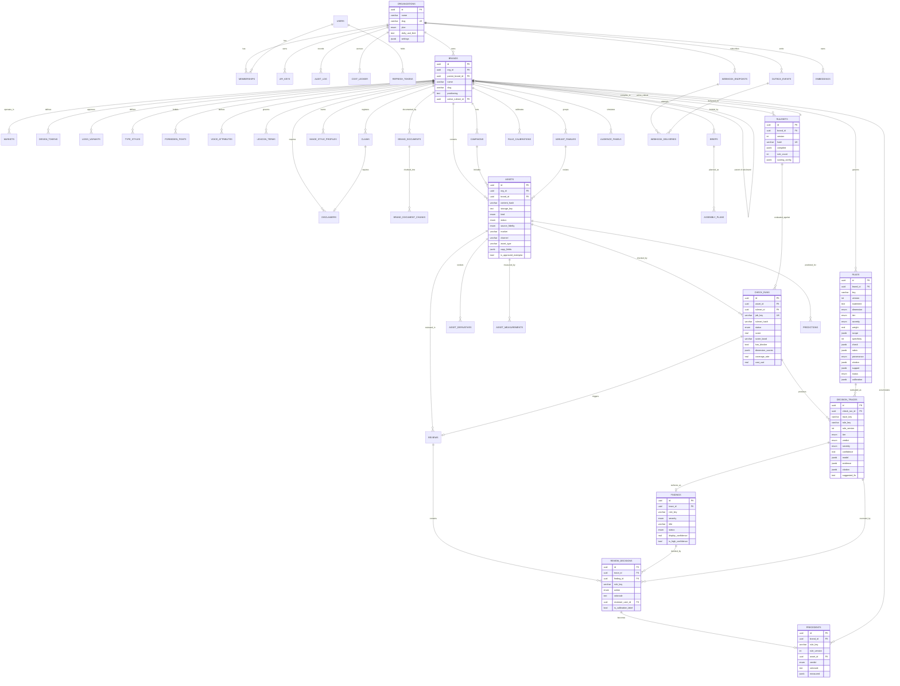

# BrandLens — Data model

PostgreSQL 15+. Schema defined in `packages/db/src/schema/*.ts` (Drizzle),
policies in `packages/db/src/sql/10_rls.sql`.

Six modules: **tenancy**, **ontology**, **assets**, **checks**, **platform**,
plus the enums shared between them.

**Contents**

1. [Conventions](#1-conventions)
2. [ER diagram](#2-er-diagram)
3. [Tenancy](#3-tenancy)
4. [Ontology](#4-ontology)
5. [Assets](#5-assets)
6. [Checks and decisions](#6-checks-and-decisions)
7. [Platform](#7-platform)
8. [Enums](#8-enums)
9. [Indexing](#9-indexing)
10. [Retention](#10-retention)

---

## 1. Conventions

| | |
|---|---|
| **Primary keys** | `uuid`, `defaultRandom()` (`gen_random_uuid()` from `pgcrypto`) |
| **Tenant column** | `org_id uuid NOT NULL` on all 38 tenant tables |
| **Timestamps** | `timestamptz`, `created_at`/`updated_at`, UTC |
| **Soft delete** | `deleted_at timestamptz` on `organizations`, `users`, `brands`, `assets` |
| **JSON** | `jsonb`, typed in TypeScript with `.$type<T>()` |
| **Arrays** | Native Postgres arrays (`text[]`, `real[]`, `uuid[]`, `integer[]`) |
| **Money** | `text` in `cost_ledger` (exact decimal strings), `real` in `check_runs` (display) |
| **Hashes** | `varchar(80)` — sha256 hex is 64 characters, with room to spare |
| **RLS** | `ENABLE` **and** `FORCE` on every tenant table |

**Why `real` and not `double precision` for measurements.** Colour coordinates,
contrast ratios and confidences carry at most 4-5 significant digits of real
information. `real` halves the storage and the index size, and `embeddings.vec`
is a `real[]` of 1 024 elements per row — the difference is measured in
gigabytes at scale.

**Why some money columns are `text`.** `cost_ledger` stores exact decimal
strings because floating point accumulates error over millions of rows and a
spend ledger has to reconcile. `check_runs.cost_usd` is `real` because it is
displayed, not summed for billing.

---

## 2. ER diagram

Core entities and the relationships that matter. Some columns are omitted for
legibility.



---

## 3. Tenancy

### `organizations`

The tenant boundary. Everything else hangs off it.

| Column | Type | Notes |
|---|---|---|
| `id` | uuid PK | |
| `name` | varchar(200) | |
| `slug` | varchar(80) | **UNIQUE** |
| `plan` | `org_plan` | `free \| team \| business \| enterprise` |
| `daily_usd_limit` | text | Soft guard rail. The hard guard is the cost ledger. |
| `settings` | jsonb | Per-tenant judge/model overrides, feature flags, retention |
| `deleted_at` | timestamptz | Soft delete |

Not in the RLS policy set — this table *describes* the tenants, so it cannot be
tenant-scoped.

### `users`, `memberships`

`users` is global; a user can belong to several organisations through
`memberships`. Uniqueness on `lower(email)`, so `Owner@x.test` and
`owner@x.test` are the same account.

`memberships.role` is `member_role`: `owner`, `admin`, `brand_manager`,
`reviewer`, `creator`, `viewer`, `service`. Treated as a hierarchy by
`RolesGuard`.

Passwords are **bcryptjs at cost 12** — not native bcrypt or argon2. The target
is a Windows VM with no compiler toolchain, and a native postinstall that fails
there turns "clone and run" into a support ticket. At cost 12 the verification
time is irrelevant next to the network round trip.

### `refresh_tokens`

Only the sha256 hash is stored: a database dump must not be a session hijack.
Rotation revokes the presented token and issues a new one in the same
transaction, so reuse of a revoked token is detectable — which is the entire
reason for storing hashes at all.

### `api_keys`

| Column | Notes |
|---|---|
| `prefix` | varchar(24), **indexed**, displayable and non-secret: `bl_live_a1b2…` |
| `key_hash` | HMAC-SHA256 with a server-side pepper, **UNIQUE** |
| `scopes` | `text[]` — `checks:read`, `checks:write`, `assets:read`, `assets:write` |
| `revoked_at` | Soft revocation; the audit trail keeps the history |

A **pepper**, not a per-row salt: lookup has to be O(1) on every request, and a
peppered digest keeps a database dump useless on its own while still being
directly indexable.

### `audit_log`

Append-only (`UPDATE`/`DELETE` revoked). Actor is a user *or* an API key,
plus action, entity type, entity id, a redacted payload, IP and user agent.

Regulated buyers pay for the trail more than for the AI, so this is a core
table rather than an add-on. **Raw creative content never goes in it.**

### `cost_ledger`

One row per paid model call: provider, model, operation, input tokens, cached
input tokens, output tokens, image count, cost, cache-hit flag, latency.
Budgets read from it; so does `GET /v1/analytics/cost`.

---

## 4. Ontology

### `brands`

Self-referencing `parent_brand_id` models sub-brands without a second table.
`active_ruleset_id` points at the currently published snapshot and is null
until the first brand compile.

`positioning` is free text fed to the judge as brand context — it is what makes
"does this feel like us" answerable at all.

### `markets`

One row per locale the brand operates in. `locale_rules` carries spelling
convention, currency, date format, legal entity, decimal separator, text
expansion factor and forbidden spellings.

### `design_tokens`

W3C DTCG format, so Figma Variables, Style Dictionary and Tailwind exports
import without a translation layer.

| Column | Notes |
|---|---|
| `path` | Dotted DTCG path, e.g. `color.brand.primary`. **UNIQUE per brand.** |
| `type` | `color \| dimension \| fontFamily \| fontWeight \| duration \| number \| shadow \| typography \| other` |
| `value` | The DTCG `$value` |
| `hex`, `lab_l`, `lab_a`, `lab_b` | **Precomputed CIELAB.** Palette conformance is a per-cluster ΔE comparison against every brand colour; re-parsing hex → sRGB → linear → XYZ → Lab inside that loop is the difference between a check that costs nothing and one that dominates the request. |
| `role` | `primary \| secondary \| accent \| neutral \| functional \| forbidden` |
| `allowed_tints` | `integer[]`, e.g. `{20,40,60,80}` |
| `usage` | Surface-share constraints, e.g. `{"minRatio":0.6}` |

`role = 'forbidden'` is what turns "don't use the competitor's green" from
folklore into a check.

### `logo_variants`

Each approved file, plus the geometry the checks need.

| Column | Notes |
|---|---|
| `kind` | `primary`, `monochrome_white`, `icon_only`, `cobrand_lockup`, … |
| `aspect_ratio` | The cheap distortion pre-filter |
| `logomark_height_px` | **The "X" unit.** Every brand book expresses clear space as a multiple of this. Getting it wrong makes every clear-space verdict wrong by a constant factor — which looks like the check being broken rather than the metadata being wrong. |
| `palette` | Approved ink colours, for recolouring detection |
| `constraints` | `clearSpaceMultiple`, `minWidthPx`, `minWidthPct`, `minWidthMm`, `allowedBackgrounds`, `allowedZones` |

Detection is **open-set**: crop → embed → kNN against this gallery, so adding a
customer never requires retraining a detector.

### `type_styles`, `forbidden_fonts`

Font identification is reframed as **closed-set verification**: a tenant has
3-10 approved faces, so the engine renders candidates and compares rather than
attempting open-set font ID.

`font_aliases` is the list of every string that must resolve to the same face —
`"Helvetica Neue LT Pro 65 Medium"`, `"HelveticaNeueLTPro-Md"`, and so on. PDF
and PPTX name the same font half a dozen ways, and a missing alias is a false
positive on a compliant asset.

`forbidden_fonts` are not aesthetic objections. Each one indicates a broken
pipeline — Times New Roman means a substituted serif, Calibri means a deck
rebuilt outside the template — which is why they carry real severities.

### `voice_attributes`

"Confident, not arrogant" only becomes checkable when it has a positive and a
negative example. Each row carries `we_are`, `we_are_not`, and arrays of
`positive_examples` and `negative_examples`.

### `lexicon_terms`

Banned, required, preferred and trademark terms, matched with an Aho-Corasick
automaton so the cost is one linear pass regardless of term count.
`market_codes` scopes a term to specific locales.

### `claims`

The highest-willingness-to-pay object in the product.

| Column | Notes |
|---|---|
| `text`, `variants` | The claim and the paraphrases that count as the same claim |
| `category` | `superlative \| comparative \| numeric \| regulatory \| endorsement` |
| `substantiation_ref`, `substantiation_url` | The evidence |
| `jurisdictions` | `text[]` of market codes. Using a claim outside them is a specific, provable breach. |
| `required_disclaimer_id` | The disclaimer that must accompany it |
| `approved_at`, `expires_at` | **Claims lapse when the evidence behind them does.** This is the check nobody performs by hand. |

### `disclaimers`

Most tools check that the text is present. BrandLens checks four things:
present, `min_font_size_pt`, `min_contrast_ratio`, and `max_proximity_pct` —
the maximum distance from the claim it qualifies, as a fraction of canvas
height. A disclaimer at 6px in grey at the opposite corner satisfies "present"
and nothing else.

### `image_style_profiles`

"Our photography is bright, candid, natural light" — learned from the approved
corpus instead of written down. Stores the fitted distribution over measurable
style features (`feature_stats`), the embedding `centroid`, and `distance_p5` —
the 5th-percentile distance in the approved corpus, which is the natural
rejection boundary.

### `rules`

The core primitive.

| Column | Notes |
|---|---|
| `key` | Stable across versions. Precedents and calibration key on this. |
| `version` | **UNIQUE** on `(brand_id, key, version)` |
| `dimension` | One of nine |
| `tier` | `deterministic \| cv \| vlm \| hybrid` |
| `severity` | `blocker` forces failure regardless of score; `advisory` never fails and weighs 0 |
| `weight` | Contribution to the dimension score |
| `scope` | The lattice selector: `subBrands`, `markets`, `channels`, `assetTypes`, `campaigns` |
| `specificity` | Weighted integer, powers of ten. Recomputed at compile time, not trusted. |
| `check` | `{ fn, params }` — `fn` names an analyzer in the engine registry |
| `rubric` | For VLM rules. Binary wherever the criterion allows — LLMs are poorly calibrated on continuous scales. |
| `provenance` | `deductive \| inductive \| transfer \| manual` |
| `citation` | `{ doc, documentId, page, bbox, extractedBy, confirmedByUserId }` |
| `support` | For induced rules: `{ sampleSize, percentile, observedValue, exampleAssetIds }` |
| `status` | `proposed \| active \| deprecated \| rejected`. **Default `proposed`.** |
| `calibration` | `{ alpha, beta, agreementRate, overrideRate, sampleSize, autoRouteToHuman }` |
| `optimized_prompt`, `optimized_prompt_hash` | Per-tenant, per-rule prompt optimisation |

### `rulesets`

The brand compile output. `hash` is **UNIQUE per brand**, which is what makes
republishing an identical snapshot a no-op rather than a duplicate version.

`compiled` is the frozen, fully-resolved snapshot of every active rule at
publish time. `scoring_config` carries the dimension weights and the pass /
conditional thresholds.

### `brand_documents`, `brand_document_chunks`

Chunks are layout-aware and carry `page`, `ordinal`, `heading`, `text` and
`bbox`, plus an optional rasterised page crop — so every extracted rule can
cite, and the review screen can render the source beside the proposal.

---

## 5. Assets

### `assets`

| Column | Notes |
|---|---|
| `content_hash` | sha256 of the bytes. **Deduplication + cache key + audit anchor.** |
| `storage_key` | `originals/<org>/<ab>/<hash>.<ext>` |
| `source_fidelity` | `structured` (PDF/Figma/PPTX/HTML — exact fonts, sizes, colours, boxes: ground truth) / `raster` (flattened: everything is inference) / `mixed` |
| `structured_source` | The parsed structure when available. Ground truth, not inference. |
| `color_profile` | **The most-missed step in the whole pipeline.** A Display-P3 asset analysed as sRGB reads as oversaturated and produces mass false "off-palette" findings. |
| `market`, `channel`, `asset_type`, `locale` | The scope-lattice coordinates |
| `copy_fields` | Headline, body, CTA, alt text — submitted alongside the creative |
| `provenance` | C2PA / Content Credentials manifest, when present |
| `is_approved_exemplar` | **Membership of the corpus used for rule induction.** This flag is the difference between the learning loop having a corpus and having nothing. |

There is **no sub-brand column**, which is why `scope.subBrands` never matches
anything at check time — sub-brand differences are expressed by owning the rule
on the sub-brand's own `brands` row. See
[architecture.md §5](architecture.md#5-the-brand-ontology-and-the-scope-lattice).

### `variant_families`

Groups a master asset with its resized derivatives. Expensive semantic checks
run **once** on the master; per-variant only geometry and channel-spec checks
run. For ad production this alone cuts VLM spend by 10-20×.

### `asset_derivatives`

Thumbnails, page rasters, evidence crops, tiles, frames, overlays. Keyed
`(asset_id, kind, transform_hash)` so they dedupe, and lifecycle-expired
aggressively — they are reproducible from the original.

### `asset_measurements`

Cached analyzer output per `(asset_id, analyzer, analyzer_version)`. A pure
function, which is why it is cached at all — and why re-checking unchanged
bytes costs nothing.

### `embeddings`

Pure functions of `(bytes, model_id, preprocessing_version)`; never recomputed.

`preprocessing_version` matters: a change to the resize/crop/normalise code
silently invalidates every vector, and without the field you would not know it
had happened.

`vec real[]` is **always** populated. When pgvector is present a migration adds
`vec_p vector(N)` plus an HNSW index and keeps it in sync by trigger, so the
same schema runs on a plain PostgreSQL install
([ADR-0003](adr/0003-pgvector-optional.md)).

---

## 6. Checks and decisions

### `check_runs`

| Column | Notes |
|---|---|
| `job_key` | **UNIQUE** on `(org_id, job_key)`. Idempotency is a database constraint. |
| `ruleset_hash`, `pipeline_version` | Reproducibility anchors |
| `score`, `score_band`, `has_blocker` | Deterministic aggregation. Never a model output. |
| `dimension_scores` | Per-dimension analytic scores |
| `criteria_*` | total / evaluated / passed / failed / abstained |
| `coverage_rate` | **The headline value metric**: the share auto-decided without a human |
| `cache_hits`, `cache_misses` | Reuse accounting — proves the cache is working |
| `degraded_reason` | Set when a budget guard trips. Deterministic findings still ship. |

### `decision_traces`

**This table is the product.** Immutable, content-addressed, append-only.

| Column | Notes |
|---|---|
| `trace_key` | `hash(assetContentHash, rulesetHash, ruleKey, ruleVersion, modelVersion, promptHash)` — the cache key and the reproducibility guarantee |
| `verdict` | `pass \| fail \| not_applicable \| insufficient_evidence \| abstained`. The last two are **mandatory** members: without them a judge is forced to invent a verdict. |
| `confidence` | **Null for deterministic tiers.** Arithmetic does not hedge. |
| `model` | Provider, id, version, prompt hash, temperature, self-consistency k, vote entropy. Null for deterministic tiers. |
| `evidence` | `{ measured, threshold, bbox, cropKey, quotedText, observation }` — **code measures, the model only judges** |
| `precedent_asset_ids` | The few-shot context used. Balanced pass/fail so the label prior does not leak and turn the judge into a yes-machine. |
| `citation` | Back to the brand book |
| `suggested_fix` | |

`UPDATE` and `DELETE` are revoked from `PUBLIC`.

### `findings`

A failed or abstained trace surfaced to humans, with a lifecycle:
`open → confirmed \| overridden \| waived \| fixed`.

`display_confidence` and `is_high_confidence` are the **precision gate**: only
findings above the display threshold are shown by default. A reviewer who sees
three bogus flags stops reading forever.

### `reviews`, `review_decisions`

`reviews.stage` supports a multi-stage MLR-style gate: `creative`, `legal`,
`brand`, `marketing_ops`.

`review_decisions` is **the gold-label stream**. `action` is `confirm`,
`override_pass`, `override_fail`, `waive`, `escalate` or `comment`.

`rationale` is required on overrides and is doing two jobs at once: it is the
audit record, *and* it is the natural-language signal that GEPA-style prompt
optimisation consumes directly, and that later renders as precedent context.

`is_calibration_label` marks double- and triple-annotated items. Clean
multi-annotator data produces far narrower judge intervals than
single-annotator data at the same sample size, which makes it the highest-ROI
labelling spend available.

### `precedents`

**UNIQUE** on `(brand_id, rule_key, rule_version, asset_id)`.

`verdict` is the **human** verdict, not the machine's. At judge time the k
nearest decided precedents for that rule are injected as in-context examples
with their verdicts and rationales — which produces "it learned our brand"
behaviour with zero training.

### `rule_calibrations`

Per-rule snapshots: `alpha`, `beta`, thresholds before and after, agreement
rate, precision, recall, Cohen's kappa, ECE, sample size, coverage at target.

`auto_route_to_human` is **the operational kill switch**. `|beta| < 0.3` means
the judge's confidence carries essentially no information about what these
reviewers will accept, so the rule is routed 100% to human review until it
improves.

---

## 7. Platform

### `channel_specs`

The registry. **`org_id IS NULL` marks a shipped global row**; a non-null
`org_id` is a tenant override that shadows it. The RLS policy admits null-org
rows for reads but requires the tenant's own id for writes.

`spec` carries aspect ratios with tolerances, min/max dimensions, byte
ceilings, formats, duration/fps/bitrate/audio for video, **safe zones**, text
limits and a text-density advisory. Print rows add trim size, bleed, safety
margin, colour space, total ink coverage, crop marks and outlined fonts.

Boring, tedious, constantly drifting — and therefore a real moat. Every
platform changes its safe zones two to four times a year and nobody maintains
them well.

**Every key in `spec` is accounted for by the engine**, and that is enforced
rather than intended: `SPEC_KEYS` in `apps/engine/brandlens_engine/channel_spec.py`
gives each one a role — `enforced` here, `delegated` to a named analyzer
(`safeZones` → `layout.safe_zone`, `minLegalFontPt` → `typography.min_size`),
`authorable` via `vlm.rubric`, `unmeasurable` with the reason, or `reference`.
It is extracted to `packages/contracts` by AST and the seed refuses to write a
registry row carrying a key with no role. Without that guard a spec key is
worse than absent: the placement publishes 3mm of bleed, the console shows 3mm
of bleed, and every asset passes. That was in fact the state of things — the
registry and the analyzer shared three keys out of forty.

### `webhook_endpoints`, `outbox_events`, `webhook_deliveries`

The **transactional outbox**. An event is written in the same transaction as the
state change it describes, and a separate relay dispatches it — so BrandLens
never emits an event for a transaction that rolled back, and never loses one
that committed.

`outbox_events.idempotency_key` is **UNIQUE**, deduplicating redelivery of the
same logical event. Rows are claimed with `FOR UPDATE SKIP LOCKED`, so two
relays never send the same event twice.

### `briefs`, `assembly_plans`

Skill 2. `assembly_plans.constraints_applied` records the rules the plan was
designed to satisfy, so **the plan is auditable too**, not just the check.

### `audience_panels`, `predictions`

Skill 3. `predictions.percentile_vs_corpus` is **relative, not absolute** — VLM
judges rank far better than they score, so a candidate is ranked against the
tenant's own past assets. `interval_low` and `interval_high` are reported
alongside; a bare number would be dishonest.

### `result_cache`

Content-addressed LLM/analysis cache. `cache_key` is the primary key.
`hits` and `cost_saved_usd` make the cache's value measurable rather than
assumed. Target hit ratio > 60%.

### `system_state`

Runtime flags surfaced on `/health/deep`. Currently `vector_driver`. Not
tenant-scoped — it describes the installation.

---

## 8. Enums

| Enum | Values |
|---|---|
| `org_plan` | `free`, `team`, `business`, `enterprise` |
| `member_role` | `owner`, `admin`, `brand_manager`, `reviewer`, `creator`, `viewer`, `service` |
| `rule_provenance` | `deductive`, `inductive`, `transfer`, `manual` |
| `rule_status` | `proposed`, `active`, `deprecated`, `rejected` |
| `severity` | `blocker`, `major`, `minor`, `advisory` |
| `check_tier` | `deterministic`, `cv`, `vlm`, `hybrid` |
| `rule_dimension` | `logo`, `color`, `typography`, `layout`, `imagery`, `copy`, `accessibility`, `channel_spec`, `legal` |
| `token_type` | `color`, `dimension`, `fontFamily`, `fontWeight`, `duration`, `number`, `shadow`, `typography`, `other` |
| `logo_variant_kind` | `primary`, `horizontal_lockup`, `stacked_lockup`, `monochrome_black`, `monochrome_white`, `knockout`, `icon_only`, `wordmark_only`, `cobrand_lockup` |
| `asset_kind` | `image`, `video`, `pdf`, `html`, `figma`, `pptx`, `psd`, `copy` |
| `asset_status` | `uploading`, `ingested`, `analyzing`, `analyzed`, `failed`, `quarantined` |
| `source_fidelity` | `structured`, `raster`, `mixed` |
| `check_run_status` | `queued`, `running`, `completed`, `failed`, `cancelled`, `degraded` |
| `verdict` | `pass`, `fail`, `not_applicable`, `insufficient_evidence`, `abstained` |
| `finding_status` | `open`, `confirmed`, `overridden`, `waived`, `fixed` |
| `review_action` | `confirm`, `override_pass`, `override_fail`, `waive`, `escalate`, `comment` |
| `review_state` | `pending`, `in_review`, `changes_requested`, `approved`, `rejected`, `withdrawn` |
| `brief_status` | `draft`, `planned`, `assembling`, `ready`, `failed` |
| `prediction_status` | `queued`, `running`, `completed`, `failed` |
| `webhook_status` | `active`, `paused`, `disabled` |
| `outbox_status` | `pending`, `dispatched`, `failed`, `dead` |
| `job_pool` | `cpu_media`, `llm_io`, `default` |

---

## 9. Indexing

Two principles.

**Every tenant index leads with `org_id`.** The RLS policy adds
`org_id = current_tenant` to every query, so an index that does not lead with
it forces a filter after the fact. This is the difference between RLS costing a
few percent and costing an order of magnitude.

**Uniqueness where correctness depends on it, not merely where it is tidy.**

| Index | Enforces |
|---|---|
| `check_runs_job_key_uq (org_id, job_key)` | Idempotency of `POST /v1/checks` |
| `rules_brand_key_version_uq (brand_id, key, version)` | Rule versioning |
| `rulesets_brand_hash_uq (brand_id, hash)` | Republishing an identical snapshot is a no-op |
| `design_tokens_brand_path_uq (brand_id, path)` | One value per DTCG path |
| `type_styles_brand_name_uq (brand_id, name)` | One "Body" per brand |
| `precedents_rule_asset_uq (brand_id, rule_key, rule_version, asset_id)` | One precedent per asset per rule version |
| `embeddings_owner_model_uq (owner_type, owner_id, space, model_id, preprocessing_version)` | Embeddings are never duplicated |
| `asset_measurements_uq (asset_id, analyzer, analyzer_version)` | Measurements are cached, not recomputed |
| `asset_derivatives_uq (asset_id, kind, transform_hash)` | Derivatives dedupe |
| `outbox_idempotency_uq (idempotency_key)` | No duplicate event delivery |
| `channel_specs_uq (platform, placement, asset_type, version, org_id)` | One spec per placement per version per tenant |
| `users_email_uq (lower(email))` | Case-insensitive email uniqueness |
| `api_keys_hash_uq (key_hash)` | No two keys share a digest |

Hot paths worth knowing about:

```sql
check_runs_org_status_idx    (org_id, status, created_at)   -- the dashboard
findings_org_status_idx      (org_id, status, created_at)   -- the queue
decision_traces_rule_idx     (org_id, rule_key, verdict)    -- rule health
review_decisions_org_rule_idx(org_id, rule_key, action)     -- override rate
outbox_pending_idx           (status, next_attempt_at)      -- the relay
assets_hash_idx              (org_id, content_hash)         -- dedupe on upload
assets_exemplar_idx          (brand_id, is_approved_exemplar) -- induction corpus
```

---

## 10. Retention

Defaults live in `organizations.settings.retention`.

| Data | Default | Why |
|---|---|---|
| `decision_traces` | 7 years | The regulated default. This is why the table is large, and it is the right trade. |
| `audit_log` | 7 years | Same. |
| `check_runs` | 7 years | Traces reference them. |
| `asset_derivatives` | 90 days | Reproducible from the originals. |
| `result_cache` | `expires_at` per row | |
| pg-boss jobs | archived 1 h, deleted 7 days | Long enough to debug a bad afternoon. |
| `webhook_deliveries` | 30 days | Debugging surface, not a record. |
| Originals | Indefinite | The traces reference their content hashes. Deleting one orphans its audit trail. |

Purging derivatives:

```sql
DELETE FROM asset_derivatives
WHERE created_at < now() - interval '90 days'
  AND kind IN ('thumbnail', 'tile', 'frame');
```

Then delete the corresponding files from `.storage/derivatives`. **Never delete
from `.storage/originals`** — the traces reference their hashes, and an
unreachable original turns a defensible audit trail into a broken one.
